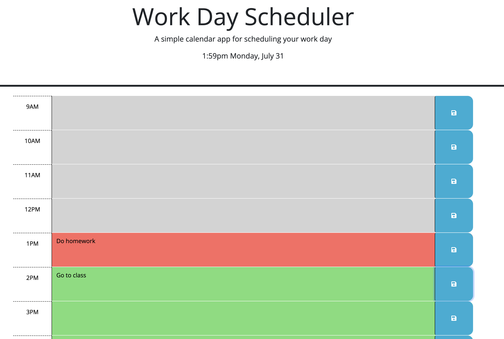

# Work Day Scheduler

## Description

In this activity we were tasked to create a script.js file to control the storage of a work day hourly calendar. That script.js file updates the CSS classes used in the HTML file to change the colors of the hours of the day depending whether or not they have past. It allows stores the information of the tasks inputted by the user into local storage.

This assignment was completed with the help of the starter code and the in class activities of UD Coding Bootcamp

## Screenshots

## Deployed App URL

https://eqmccullough.github.io/Work-Day-Scheduler/
